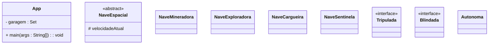

# Lista 4 - Frota Espacial Polimórfica

## Nome: Isabella Corrêa

```mermaid
classDiagram
    
    class App {
        - garagem : Set<NaveEspacial>
        + main(args : String[]) : void
    }
    
    class NaveEspacial {
        <<abstract>>
        
        # velocidadeAtual
    }
    
    class NaveMineradora {
        
    }
    
    class NaveExploradora {
        
    }
     class NaveCargueira {
         
     }
     
     class NaveSentinela {
         
     }
     
     class Tripulada{
         <<interface>>
     }
     
     class Blindada {
         <<interface>>
     }
     
     class Autonoma {
         
     }
    
    
```